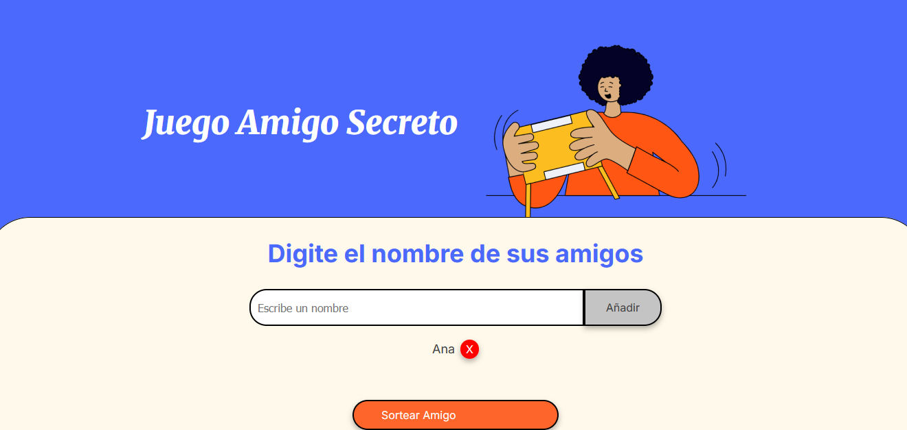
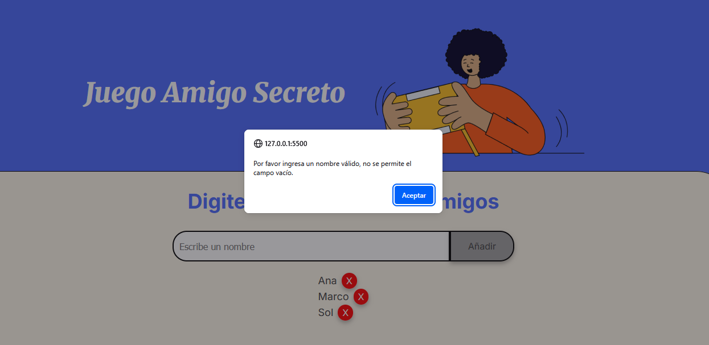
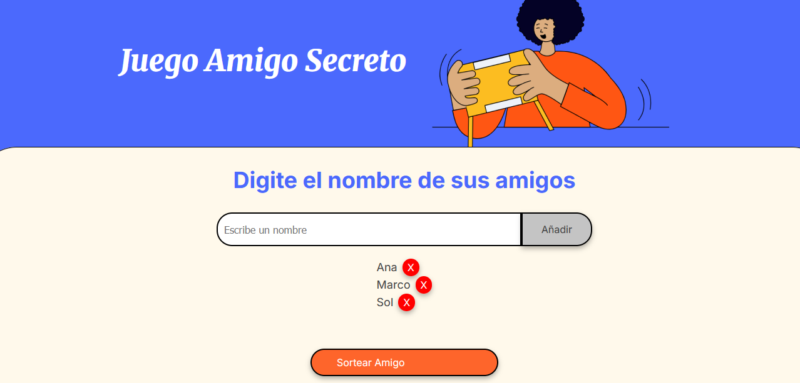
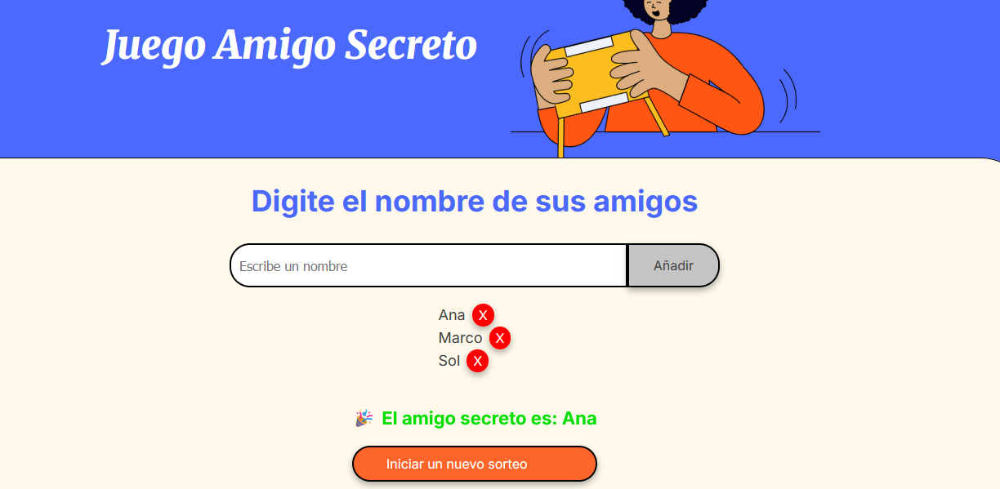

# challenge-amigo-secreto
Aplicación web sencilla en JavaScript que permite agregar nombres a una lista y realizar un sorteo aleatorio para determinar el "amigo secreto".

## 📌 Fucionalidades:
**Agregar nombres:** Los usuarios escribirán el nombre de un amigo en el campo de texto y lo agregarán a una lista visible al hacer clic en "Adicionar".
 

**Validar entrada:** Si el campo de texto está vacío, el programa mostrará una alerta pidiendo un nombre válido.

**Visualizar la lista:** Los nombres ingresados aparecerán en una lista debajo del campo de entrada y se muestra con un botón "X" para eliminarlo de la lista en el caso de que haya ocurrido un error.

**Sorteo aleatorio:** Al hacer clic en el botón "Sortear Amigo", se seleccionará aleatoriamente un nombre de la lista y se mostrará en la página. ///Luego el botón cambia a Iniciar un nuevo sorteo. Al hacer clic en ese botón nuevamente, se limpia la lista de amigos y el resultado, volviendo al estado incial del juego.

## 📌 Cómo usar
1. Ingresa un nombre en el campo de texto.
2. Haz clic en **"Adicionar"** para agregarlo a la lista.
3. Si ingresas un nombre vacío o duplicado, se mostrará una alerta.
4. Puedes eliminar nombres de la lista con el botón **"X"**.
5. Haz clic en **"Sortear Amigo"** para seleccionar uno al azar.
6. El botón cambiará a **"Iniciar un nuevo sorteo"** para reiniciar el juego.

 ## 🛠️ Tecnologías utilizadas
- HTML5
- CSS3
- JavaScript
